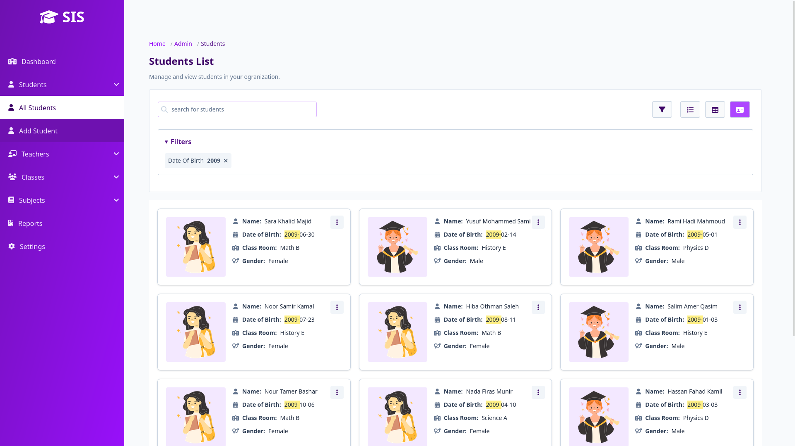

# EduPulse – Student Information System (SIS)

EduPulse is a comprehensive and scalable **Student Information System (SIS)** built with **Django** (Backend) and **React** (Frontend). Designed for schools, academies, and educational organizations, EduPulse simplifies the management of students, staff, classes, attendance, and communications – all in one secure platform.

---

## 🎯 Features

### 🧑‍🎓 Student Management
- Add, edit, and remove students
- View student profiles with personal, academic, and contact information
- Assign students to classrooms

### 🏫 Academic Management
- Class and grade structure setup
- Subject management
- Timetable scheduling (optional/future)

### 👨‍🏫 Staff and Teacher Management
- Admin panel for managing staff roles and permissions
- Assign teachers to specific classrooms or subjects

### 🧾 Attendance and Performance
- Daily attendance tracking
- Performance tracking and grading (coming soon)

### 📩 Email & Notification System
- Send announcements, notices, and updates via email to:
  - Students
  - Parents
  - Staff
- Automated birthday or event emails (optional)

### 🔐 Authentication & Roles
- Secure user login/signup
- Admin, staff, teacher roles
- Role-based access control

### 📊 Dashboard
- Overview of total students, classrooms, active staff, etc.
- Filtered views by class, age, gender

### 🌐 Fully Responsive UI
- Clean and responsive interface using **TailwindCSS**
- Accessible across desktop, tablet, and mobile devices

---

## 🛠 Tech Stack

| Tech             | Description                          |
|------------------|--------------------------------------|
| **Django**       | Backend framework, REST API (DRF)    |
| **React**        | Frontend SPA using TypeScript        |
| **Tailwind CSS** | Utility-first modern UI framework    |
| **PostgreSQL**   | Default production database          |
| **Docker**       | Containerized dev & prod environments|
| **SMTP / Mailgun** | For sending system emails          |

---

## 🚀 Getting Started

### Prerequisites
- Python 3.10+
- Node.js 18+
- PostgreSQL (or SQLite for dev)

